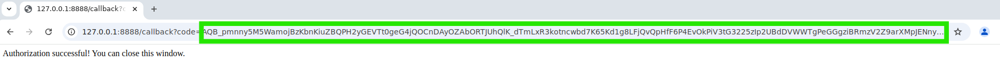
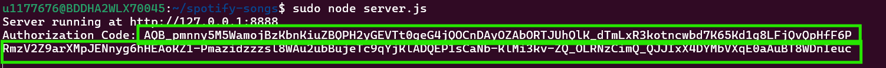

# Spotify Songs Playlist Creator
This will allow to create a Spotify playlist with songs from the PREFFERED BANDS using the Spotify Web API.
## Prerequisites
- Node.js and npm installed to the machine.
- A Spotify Developer account and a registered application to get `clientId` and `clientSecret`.
## Installation
1. Clone the repository:
   ```bash
        git clone https://github.com/mdallrabbi/Create-Spotify-Playlist.git
        cd Create-Spotify-Playlist
   ```
2. Install the dependencies:
    ```bash
        npm install
    ```
## Configuration
1. Create a .env file in the root directory and to store Spotify credentials:
    ```plaintext
        CLIENT_ID=<CLIENT_SECRET>
        CLIENT_SECRET=<CLIENT_SECRET>
        REDIRECT_URI=http://127.0.0.1:8888/callback
    ```
2. Replace the placeholder values in getAccessToken.mjs with actual clientId, clientSecret, and redirectUri.
## Usage
1. Start the authorization server:
    ```bash
       node server.js
    ```
2. Open the web browser 
    ```bash
        google-chrome --no-proxy-server
    ```
3. navigate to the Spotify authorization URL:
    ```plaintext
        https://accounts.spotify.com/authorize?client_id=<CLIENT_SECRET>&response_type=code&redirect_uri=http://127.0.0.1:8888/callback&scope=playlist-modify-private
    ```
3. After authorizing the application, it will be redirected to the callback URL with an authorization code. This code will be logged in the terminal.
    
    
4. Run the bellow script to get the access token:
    ```node getAccessToken.mjs
    ```
5. Replace the placeholder ```accessToken``` in tracks.mjs with the access token you received.
    ```plaintext
        authorizationCode = 'AQBTOoUA4d-----------PvTloavDZ50pQ'; // Replace with your authorization code
6. Run the main script to create the playlist:
    ```node tracks.mjs
    ```
7. Close the browser
    ```ps aux | grep -E 'apt|dpkg'
       sudo kill -9 <PID>
    ```
## To make some other playlist update the variables bellow
1. Update Bands
    ```javascript
        const bands = [
            'Pink Floyd', 'Guns N\' Roses', 'Metallica', 'Scorpions', 'Black Sabbath',
            'The Beatles', 'Lynyrd Skynyrd', 'Justin Timberlake', 'John Mayer',
            'Iron Maiden', 'Dream Theater'
        ];
    ```
2. Update Album Name
    ```javascript
    const playlistId = await createPlaylist(userId, '**Echoes of the Eternal**', token);
    ```
## Check which song you listen most
    ```node mostListenedSongs.js
    ```
## Debugging
- The scripts include console logs to help with debugging. Check the terminal output for any errors or messages.
## Contributing
- Feel free to open issues or submit pull requests if you have any improvements or suggestions.
## Author
[LinkedIn] (https://www.linkedin.com/in/mdallrabbi/)
[GitHub] (https://github.com/mdallrabbi)
[Website] (http://allrabbi.com/)
[Youtube] ()
## License

This project is licensed under the MIT License.

```text
MIT License

Copyright (c) [2025] [MD ALL RABBI]

Permission is hereby granted, free of charge, to any person obtaining a copy
of this software and associated documentation files (the "Software"), to deal
in the Software without restriction, including without limitation the rights
to use, copy, modify, merge, publish, distribute, sublicense, and/or sell
copies of the Software, and to permit persons to whom the Software is
furnished to do so, subject to the following conditions:

The above copyright notice and this permission notice shall be included in all
copies or substantial portions of the Software.

THE SOFTWARE IS PROVIDED "AS IS", WITHOUT WARRANTY OF ANY KIND, EXPRESS OR
IMPLIED, INCLUDING BUT NOT LIMITED TO THE WARRANTIES OF MERCHANTABILITY,
FITNESS FOR A PARTICULAR PURPOSE AND NONINFRINGEMENT. IN NO EVENT SHALL THE
AUTHORS OR COPYRIGHT HOLDERS BE LIABLE FOR ANY CLAIM, DAMAGES OR OTHER
LIABILITY, WHETHER IN AN ACTION OF CONTRACT, TORT OR OTHERWISE, ARISING FROM,
OUT OF OR IN CONNECTION WITH THE SOFTWARE OR THE USE OR OTHER DEALINGS IN THE
SOFTWARE.
